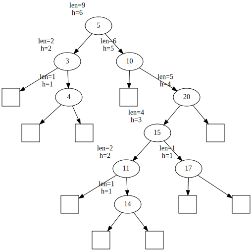

[](https://classroom.github.com/online_ide?assignment_repo_id=9110987&assignment_repo_type=AssignmentRepo)
# Хоёртын Хайлтын Мод
 

Хаяган хувьсагч ашиглан хоёртын хайлтын модыг хэрэгжүүлнэ. Хайлтын модонд дандаа **ЯЛГААТАЙ** утгууд оруулна гэж үзэж болно.

**Даалгаврын хийхэд `NULL` хаягт хандвал үргэлж `segmentation fault` авахыг анхаарна уу!**

## Ерөнхий файл
`DS.h` нь бүтцийн ерөнхий толгой файл. Уг файл дотор хэрэгжүүлэх функцүүд зарлагдсан байна.

## Даалгаврыг хийх заавар

Энэ даалгаврыг хийхэд шаардлагатай мэдлэг:
  1. Си хэлний бүтэц (struct)
  2. Си хэлний хаяган хувьсагч, дам хандалтын ойлголт (pointer, dereference)
  3. Динамикаар санах ой хуваарилах `malloc` функц, чөлөөлөх `free` функц
  
Модны орой бүр дараах мэдээллийг агуулна.

| Elm    |
|:------:|
| x      |
| height |
| len    |
| *L     |
| *R     |
|        |

  * `x`: Тухайн оройд хадгалагдах утгыг хадгална.
  * `height`: Тухайн орой дээр үндэстэй дэд модны өдрийг хадгална. Дэд мод гэдэг нь өөрийг нь оролцуулан, өөрийн бүх үр удмыг багтаасан хоёртын хайлтын мод байна.
  * `len`: Тухайн орой дээр үндэстэй дэд модонд хэдэн элемент байгааг хадгална. 
  * `*L`: Зүүн хүүхдийн хаягийг заах хаяган хувьсагч. Өөрөөр хэлбэл зүүн дэд модны хаяг гэж ойлгож бас болно.
  * `*R`: Баруун хүүхдийн хаягийг заах хаяган хувьсагч. Өөрөөр хэлбэл баруун дэд модны хаяг гэж ойлгож бас болно.

Модны орой бүрийн хадгалах, эдгээр мэдээллийг 
```C
struct Elm {
        int x;
        int height;
        int len;
        struct Elm *L;
        struct Elm *R;
};
typedef struct Elm Elm;
```
бүтцэд хадгална. Тухайн оройн зүүн баруун, хүүхэдгүй бол L, R хаяган хувьсагчууд нь `NULL` хаягийг хадгалах ёстой. Харин `height = 1`, `len = 1` байна.



Дээрх зурагт үзүүлсэн ХХМны оройнуудын мэдээллийг зүүн дээд хэсэгт нь харуулсан. Дөрвөлжин дүрсээр хоосон оройг харуулав.

Хоёртын Хайлтын Модыг хадгалахад модны үндэс оройг заах ганц хаяган хувьсагч хэрэгтэй. Үүнийг 
```C
struct BST {
        Elm *root;
};
```
бүтцэд хадгалах болно. Хэрэгжүүлэх функцүүд нь `BST` бүтцийн хаягийг хүлээн авах ба дотор нь модны үндэс хадгалагдсан тул модны бүх элементийг үндсээс нь хөөн хандах боломжтой.

### Функцүүдийг хэрэгжүүлэх заавар
Функцүүдийг хэрэгжүүлэхдээ модны үндсийг хадгалах `BST` бүтцэн хувьсагчийн хаягийг хүлээн авах ба түүний модны үндсийг хадгалах `root` хувьсагчаас хөөн бусад гишүүдэд хандана.

Өөрийн хэрэглэх функцүүдийг хүссэнээрээ зарлан ашиглах боломжтой. Жишээ нь оруулах үйлдлийг лекц дээр үзсэнээр дараах байдлаар хэрэгжүүлэх боломжтой.
```C
void bs_put(BST *ptree, int x)
{
    ptree->root = insert1(ptree->root, x);
    // эсвэл
    insert2(ptree->root, x, NULL);
}
```

### Хэрэгжүүлэх функцүүд

  * Оруулах функц: ХХМнд `x` утгыг оруулна. Оруулахдаа хоёртын хайлтын модны зарчмаар оруулах бөгөөд оруулсан байрлалаас дээшхи өвөг эцгийн `len`, `height` утгууд өөрчлөгдөнө. Мод хоосон байсан бол `ptree->root` хаяг өөрчлөгдөж шинээр орсон оройг заана.
    ```C
    void bs_put(BST *ptree, int x);
    ```

  * Хайх функц: ХХМноос `x` утгыг хайн олдсон оройн `Elm*` хаягийг буцаана. Олдохгүй бол `NULL` хаягийг буцаана. Мод дандаа ялгаатай элементүүд хадгална гэж үзэж болно. ХХМнд ямарч өөрчлөлт орохгүй.
    ```C
    Elm *bs_get(const BST *ptree, int x);
    ```
    
  * Устгах функц: ХХМноос `x` утгыг хайж олоод устгана. Олдохгүй бол юу ч хийхгүй. Устсан оройн нөлөөлөх оройнуудын `len`, `height` утгуудыг шинэчилнэ.
    ```C
    void bs_del(BST *ptree, int x);
    ```
    
  * Хамгийн багыг устгах функц: ХХМноос хамгийг бага утгыг нь устгах функц. Устгасан утгыг буцаана. Мод хоосон эсэхийг шалгах шаардлагагүй. Устсан оройн нөлөөлөх оройнуудын `len`, `height` утгуудыг шинэчилнэ.
    ```C
    int bs_delMin(BST *ptree);
    ```
    Жишээ нь дээрх ХХМын хувьд `3` утгыг устгаад, буцаана.

  * Хэвлэх функц: ХХМыг inorder дарааллаар, нэг оройн мэдээллийг нэг мөрөнд хэвлэнэ. Оройн мэдээллийг хэвлэхдээ `x`, `len`, `height` гэсэн дарааллаар хэвлэнэ.
    ```C
    void bs_inorder(const BST *ptree);
    ```
    Жишээ нь дээрх ХХМыг хэвлэхэд дараах байдалтай хэвлэгдэнэ.
    ```
    3 2 2
    4 1 1
    5 9 6
    10 6 5
    11 2 2
    14 1 1
    15 4 3
    17 1 1
    20 5 4
    ```
  * Зэргийг олох функц: ХХМноос `x` утгаас эрс бага буюу тэнцүү байх хэдэн орой байгааг олж буцаана. Өөрөөр хэлбэл хоёртын хайлтын модны утгуудыг өсөх дарааллаар байрлуулбал `x`-ийг оролцуулаад өмнө хэдэн тоо байх вэ? гэсэн үг. `x` утга заавал модонд байх албагүй.
    ```C
    int bs_rank(const BST *ptree, int x);
    ```
    Жишээ нь дээрх ХХМын хувьд `x = 12` бол `rank` нь `5`-ыг буцаана.
    
  * Хэмжээг буцаах функц: ХХМноос `x` утгатай оройг хайж олоод, тухайн оройд суурилсан дэд модонд хэдэн орой байгааг олж буцаана. Олдохгүй бол -1-ийг буцаана.
    ```C
    int bs_size(const BST *ptree, int x);
    ```
    Жишээ нь дээрх ХХМны хувьд `x = 20` бол `size` нь `5`-ыг буцаана.
    
  * Доод элемент буцаах: XXMноос `x`-ээс бага буюу тэнцүү байх хамгийн их утгын `Elm *` хаягийг олж буцаана. Олдохгүй бол `NULL` хаягийг буцаана.
    ```C
    Elm *bs_floor(const BST *ptree, int x);
    ```
    Жишээ нь дээрх ХХМны хувьд `x = 18` бол `floor` нь `17`-н `Elm *` хаягийг буцаана.
    
  * Дээд элемент буцаах: XXMноос `x`-ээс их буюу тэнцүү байх хамгийн бага утгын `Elm *` хаягийг олж буцаана. Олдохгүй бол `NULL` хаягийг буцаана.
    ```C
    Elm *bs_ceiling(const BST *ptree, int x);
    ```
    Жишээ нь дээрх ХХМны хувьд `x = 6` бол `ceiling` нь `10`-н `Elm *` хаягийг буцаана.
    
  * Өндрийг буцаах: ХХМноос `x` утгатай оройг хайж олоод, тухайн оройд суурилсан дэд модны өндөр хэд байгааг олж буцаана. Олдохгүй бол -1-ийг буцаана.
    ```C
    int bs_height(const BST *ptree, int x);
    ```
    Жишээ нь дээрх ХХМны хувьд `x = 15` бол `height` нь `3`-г буцаана.
